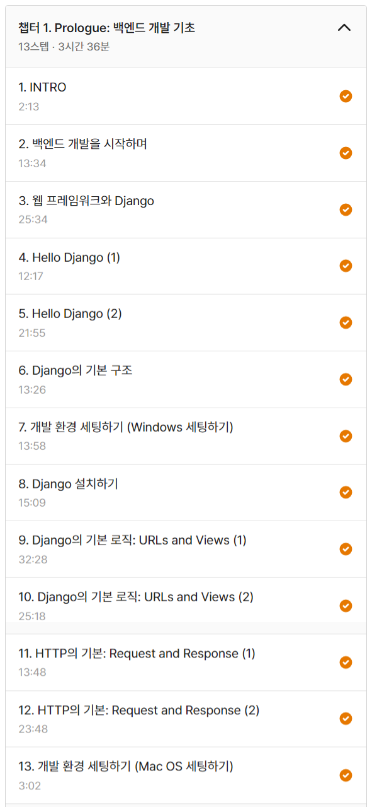
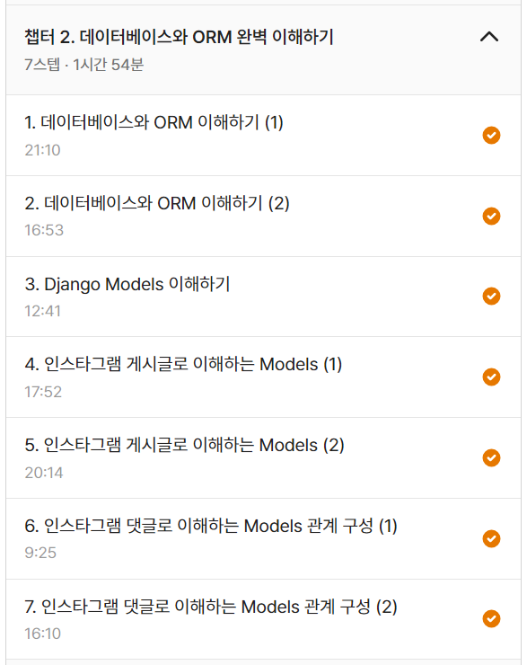
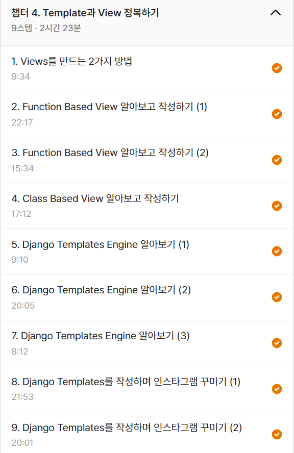

# techit
**멋쟁이사자처럼 테크잇 백엔드 트랙 스터디 기록**  
Notion: [나의 소중한 스터디 기록](https://swyg.link/9QTMr)  
강의자료: [https://github.com/3chamchi/project-lion-backend-django](https://github.com/3chamchi/project-lion-backend-django)

>### 1주차

>### 2주차

>### 3주차

>### 4주차

>### 5주차

>### 6주차
